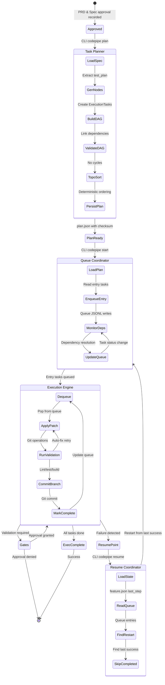
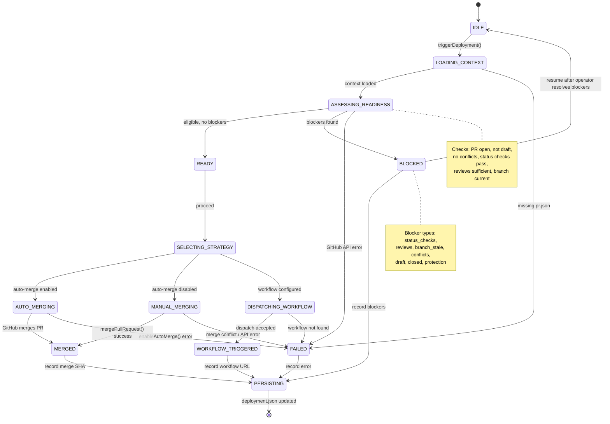
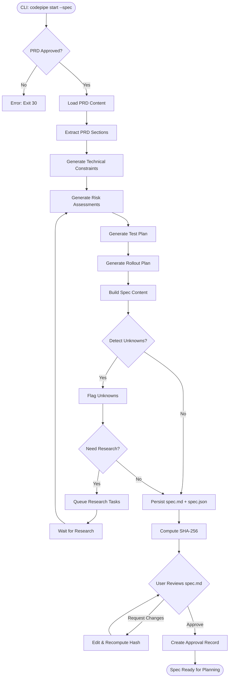

# Execution Flow Architecture

**Version:** 1.0.0
**Status:** Active
**Last Updated:** 2026-01-03

## Overview

This document describes the execution flow architecture for the AI Feature Pipeline, focusing on the CLIExecutionEngine and its integration with external execution providers like CodeMachine CLI.

## Architecture Components

### CLIExecutionEngine

The central orchestrator for task execution. Manages:

- Queue-based task processing from plan.json
- Strategy selection and delegation
- Retry logic with exponential backoff
- Artifact capture and path validation
- Telemetry integration

**Location:** `src/workflows/cliExecutionEngine.ts`

### Execution Strategy Pattern

```
┌─────────────────────────────────────────────────────────────────┐
│                      CLIExecutionEngine                          │
│  ┌─────────────┐  ┌─────────────┐  ┌─────────────────────────┐  │
│  │ Task Queue  │──│  Strategy   │──│  Result Normalization   │  │
│  │  Manager    │  │  Selector   │  │  & Artifact Capture     │  │
│  └─────────────┘  └─────────────┘  └─────────────────────────┘  │
└─────────────────────────────────────────────────────────────────┘
                            │
              ┌─────────────┼─────────────┐
              ▼             ▼             ▼
    ┌─────────────┐  ┌─────────────┐  ┌─────────────┐
    │ CodeMachine │  │   Native    │  │   Future    │
    │  Strategy   │  │  Strategy   │  │  Strategies │
    └─────────────┘  └─────────────┘  └─────────────┘
              │
              ▼
    ┌─────────────────────────────────────────────┐
    │            CodeMachineRunner                 │
    │  ┌─────────┐  ┌─────────┐  ┌─────────────┐  │
    │  │ CLI     │  │  Log    │  │  Result     │  │
    │  │ Spawner │  │ Streamer│  │  Parser     │  │
    │  └─────────┘  └─────────┘  └─────────────┘  │
    └─────────────────────────────────────────────┘
```

### Component Responsibilities

| Component           | Responsibility                                   |
| ------------------- | ------------------------------------------------ |
| CLIExecutionEngine  | Queue processing, retry orchestration, telemetry |
| ExecutionStrategy   | Interface for pluggable execution backends       |
| CodeMachineStrategy | CodeMachine CLI delegation                       |
| CodeMachineRunner   | CLI subprocess management, log streaming         |
| TaskMapper          | Task type to workflow mapping                    |
| ResultNormalizer    | Exit code interpretation, credential redaction   |

## Execution Flow

### Task Lifecycle

```
pending → running → completed
                  → failed (recoverable) → retry → running
                  → failed (permanent) → skipped
                  → timeout → failed
```

### Retry Logic

- Maximum 3 attempts per task (configurable)
- Exponential backoff: 1s, 2s, 4s base delays
- Jitter applied to prevent thundering herd
- Only recoverable errors trigger retry

### Artifact Capture

After successful task execution:

1. Validate task ID (no path traversal)
2. Scan workspace for output files
3. Copy artifacts to run directory
4. Record in task result metadata

**Security:** Path traversal prevention via `isPathContained()` validation.

## Integration Points

### CodeMachine CLI

**Prerequisites:**

- `codemachine` binary in PATH
- Valid configuration at `.codemachine/config.json`

**Validation:**

```bash
codemachine --version
```

**Task Execution:**

```bash
codemachine run --task <task_id> --workspace <path>
```

### Telemetry

Events emitted during execution:

| Event              | Timing                     | Data                          |
| ------------------ | -------------------------- | ----------------------------- |
| `taskStarted`      | Before strategy execution  | taskId, taskType, attempt     |
| `taskCompleted`    | After successful execution | taskId, durationMs, artifacts |
| `taskFailed`       | After failed execution     | taskId, error, recoverable    |
| `executionStopped` | On graceful shutdown       | completedCount, failedCount   |

## Configuration

### RepoConfig Execution Settings

```json
{
  "execution": {
    "default_engine": "claude",
    "codemachine_cli_path": "codemachine",
    "task_timeout_ms": 1800000,
    "max_parallel_tasks": 1,
    "max_retries": 3
  }
}
```

### Environment Variables

| Variable                            | Purpose                                   | Default |
| ----------------------------------- | ----------------------------------------- | ------- |
| `CODEMACHINE_BIN_PATH`              | Override CLI binary location              | `-`     |
| `CODEPIPE_EXECUTION_CLI_PATH`       | Override `execution.codemachine_cli_path` | `-`     |
| `CODEPIPE_EXECUTION_DEFAULT_ENGINE` | Override `execution.default_engine`       | `-`     |
| `CODEPIPE_EXECUTION_TIMEOUT_MS`     | Override `execution.task_timeout_ms`      | `-`     |

Verbosity is controlled via CLI flags (e.g. `--verbose`); there is no `CODEMACHINE_LOG_LEVEL` environment variable.

## Error Taxonomy

### Recoverable Errors

- Network timeouts
- Rate limiting (429)
- Temporary service unavailable (503)
- CLI spawn failures (transient)

### Permanent Errors

- Invalid task configuration
- Missing required files
- Authentication failures
- Schema validation errors

### Human Action Required

- Approval gates pending
- Manual merge conflicts
- Security policy violations

## Security Considerations

### CLI Path Validation

Before spawning CodeMachine CLI:

- Reject paths with `..` traversal
- Reject shell metacharacters (`;`, `|`, `&`, `$`, etc.)
- Validate binary exists and is executable

### Credential Redaction

All log output passes through ResultNormalizer which redacts:

- API keys and tokens (Bearer, ghp*, ghu*, ghs*, ghr*, sk-, xoxb-)
- Private keys (BEGIN.\*PRIVATE KEY)
- Connection strings (password=, secret=)
- JWT tokens
- AWS credentials

## Diagrams

### Execution Engine State Machine

> Converted from [`docs/diagrams/execution_flow.puml`](../diagrams/execution_flow.puml).



### Deployment & Resume State Machine

> Converted from [`docs/diagrams/deployment_resume_state.puml`](../diagrams/deployment_resume_state.puml).



### Specification Composer Flow

> From [`docs/diagrams/spec_flow.mmd`](../diagrams/spec_flow.mmd).



### Data Flow

```
plan.json → CLIExecutionEngine → Strategy → Runner → Subprocess
                ↓                              ↓
           queue.json                     stdout/stderr
                ↓                              ↓
           telemetry/                   ResultNormalizer
                                              ↓
                                        NormalizedResult
                                              ↓
                                        artifacts/ capture
```

## Related Documentation

- [Component Overview](../diagrams/component_overview.md) - System architecture
- [Run Directory Schema](../requirements/run_directory_schema.md) - State persistence
- [CodeMachine Adapter Guide](../ops/codemachine_adapter_guide.md) - Operational guide
- [Agent Manifest Schema](../requirements/agent_manifest_schema.json) - Task definitions

## Change Log

| Version | Date       | Changes                                                      |
| ------- | ---------- | ------------------------------------------------------------ |
| 1.0.0   | 2026-01-03 | Initial execution flow documentation for CodeMachine adapter |
