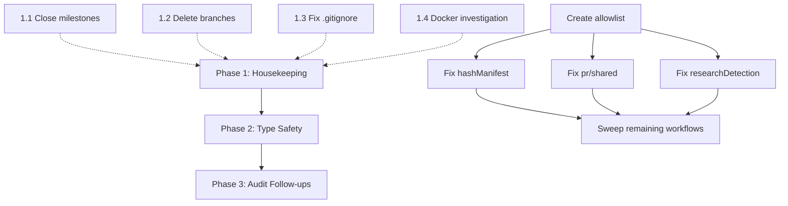

# Post-v1.0.0 Remaining Work

## Enhancement Summary

**Deepened on:** 2026-02-11
**Research agents used:** 6 (TypeScript type safety, Docker OCI rlimit, git branch cleanup, .gitignore/telemetry, architecture review, institutional learnings)

### Key Improvements
1. Revised `.gitignore` strategy: selective exclusion (not blanket) to keep `config.json` and `templates/` tracked
2. Added concrete Graphite-aware branch verification commands (`git merge-base --is-ancestor`)
3. Expanded Docker OCI investigation with root cause analysis (runc issues #4195, #5021) and prioritized fixes
4. Enhanced type safety approach with ESLint `no-restricted-types` rule, `noUncheckedIndexedAccess` recommendation, and Zod migration patterns
5. Added test validation as Phase 2 acceptance criterion

### New Considerations Discovered
- Blanket `.codepipe/` exclusion would break tracked `config.json` and `templates/` — use selective exclusion instead
- `git branch --merged` is useless for Graphite rebase workflows — must use ancestor checks
- Docker OCI rlimit is likely a systemd service limit issue on the runner, not a daemon.json misconfiguration

## Overview

v1.0.0 is released, documentation cleanup is done, all Cycle 7 and Cycle 8 issues are closed. This plan covers the housekeeping, type safety, and forward-looking work that remains.

## Current State (verified 2026-02-11)

| Dimension | Status |
|-----------|--------|
| Git tag v1.0.0 | Published |
| GitHub Release | Published |
| Tests | 265 pass, 0 fail |
| Lint | 0 errors |
| npm audit | 0 vulnerabilities |
| CLI docs drift | No drift |
| Docker build | Passes |
| Docker run | OCI rlimit error (runner environment issue) |
| Open issues | 1 (#202 type safety) |
| Open PRs | 0 |
| Stale remote branches | 27 |
| Milestones to close | 2 (Cycle 7: Testing & Docs, Cycle 8: Documentation Tooling & Type Safety) |

## Phase 1: Housekeeping (immediate, no code changes)

### 1.1 Close milestones

Both milestones have 0 open issues:

- **Milestone 1:** "Cycle 7: Testing & Docs" (4 closed issues)
- **Milestone 2:** "Cycle 8: Documentation Tooling & Type Safety" (4 closed issues)

```bash
gh api repos/KingInYellows/codemachine-pipeline/milestones/1 -X PATCH -f state=closed
gh api repos/KingInYellows/codemachine-pipeline/milestones/2 -X PATCH -f state=closed
```

### 1.2 Delete stale remote branches

27 branches to delete (4 merged Graphite temp + 23 unmerged feature branches whose PRs are all merged via Graphite rebase):

**Merged (Graphite temp):**
```
origin/gtmq_spec_393d71_1770415244578-7f5c9781-3556-4306-a67e-a0a74696b070
origin/gtmq_spec_393d71_1770415247477-b7a95a4f-e554-44ef-a167-57934b370b5e
origin/gtmq_spec_44dc02_1770361680092-057f0d0c-bbd9-4197-b40f-28cacc57d166
origin/gtmq_spec_60ec70_1770417086150-d157633b-2d7e-4100-857d-860f53f92ff4
```

**Feature branches (work merged, branches stale):**
```
origin/cdmch-55-deployment-context
origin/cdmch-55-github-adapter-types
origin/cdmch-55-http-types
origin/cdmch-55-http-utils
origin/cdmch-55-queue-integrity
origin/cdmch-56-schema-validation-foundation
origin/cdmch-57-testing-docs
origin/cdmch-63-remove-v1-src
origin/cdmch-63-remove-v1-tests-docs
origin/cdmch-64-prune-unused-exports
origin/cdmch-66-circular-dep-guardrail
origin/cdmch-76-async-loadrepoconfig
origin/cdmch-78-homelab-quickstart
origin/cdmch-93-unify-loggerinterface
origin/cdmch-94-consolidate-geterrormessage
origin/cdmch-95-audit-record-string-unknown
origin/dependabot/npm_and_yarn/eslint-10.0.0
origin/dependabot/npm_and_yarn/minor-and-patch-d5a650a1db
origin/feature/cdmch-53-standardize-cli-error-handling-with-actionable-remediation
origin/feature/cdmch-69-reliability-verify-queue-integrity-on-startup-snapshot-wal
origin/feature/cdmch-79-release-v100-readiness-and-launch-checklist
origin/feature/cdmch-80-release-v100-update-changelog-tag-and-publish
origin/fix/smoke-test-missing-await
```

**Keep:** `main`, `archive/pre-v1.0.0-docs`

#### Research Insights: Graphite Rebase Verification

**Critical:** `git branch --merged` is useless for Graphite's rebase-based workflow. Branches show as "unmerged" even though their commits are in main (rebased, not merge-committed). Use ancestor checks instead:

```bash
# Verify a single branch is safe to delete
git merge-base --is-ancestor origin/BRANCH origin/main && echo "Safe" || echo "Unsafe"
```

**Recommended deletion approach (safe, with verification):**

```bash
# Step 1: Fetch latest
git fetch origin

# Step 2: Delete Graphite temp branches (always safe)
git push origin --delete \
  gtmq_spec_393d71_1770415244578-7f5c9781-3556-4306-a67e-a0a74696b070 \
  gtmq_spec_393d71_1770415247477-b7a95a4f-e554-44ef-a167-57934b370b5e \
  gtmq_spec_44dc02_1770361680092-057f0d0c-bbd9-4197-b40f-28cacc57d166 \
  gtmq_spec_60ec70_1770417086150-d157633b-2d7e-4100-857d-860f53f92ff4

# Step 3: Delete feature branches with ancestor verification
git branch -r --no-merged origin/main | grep -v "origin/HEAD\|archive/" | while read b; do
  if git merge-base --is-ancestor "$b" origin/main 2>/dev/null; then
    git push origin --delete "${b#origin/}"
  else
    echo "SKIP (not ancestor): $b"
  fi
done

# Step 4: Clean up local refs
git remote prune origin
git branch -vv | grep ': gone]' | awk '{print $1}' | xargs -r git branch -d
gt sync
```

**Post-cleanup verification:**
```bash
git branch -r | wc -l  # Expected: 3 (main, HEAD, archive/pre-v1.0.0-docs)
```

### 1.3 Fix .gitignore for .codepipe/ telemetry

Currently only `.codepipe/runs/` and `.codepipe/logs/` are excluded. The `metrics/` and `telemetry/` subdirectories are runtime artifacts that should not be tracked.

**File:** `.gitignore`

**Change:** Add selective exclusions (not blanket — `config.json` and `templates/` must stay tracked):

```diff
 # CodeMachine Pipeline runtime
 .codepipe/runs/
 .codepipe/logs/
+.codepipe/metrics/
+.codepipe/telemetry/
```

Then unstage the tracked files:

```bash
git rm --cached .codepipe/metrics/prometheus.txt
git rm --cached .codepipe/telemetry/traces.json
```

#### Research Insights: .gitignore Strategy

**Why selective, not blanket:** 5 files are currently tracked under `.codepipe/`:

| File | Type | Action |
|------|------|--------|
| `config.json` | User-editable config | **Keep tracked** |
| `templates/config.example.json` | Reference template | **Keep tracked** |
| `templates/run_manifest.json` | Reference template | **Keep tracked** |
| `metrics/prometheus.txt` | Runtime data | **Untrack** |
| `telemetry/traces.json` | Runtime data | **Untrack** |

A blanket `.codepipe/` exclusion would require re-adding `!.codepipe/config.json` and `!.codepipe/templates/` negation patterns, which is fragile. Selective exclusion is simpler and safer.

**Best practice (oclif/npm/Yarn precedent):** CLI tools store runtime telemetry in XDG directories (`~/.local/state/`), not in the project. Consider migrating telemetry output to `$XDG_STATE_HOME/codepipe/` in a future release.

### 1.4 Investigate Docker OCI rlimit issue

**Symptom:** `docker run` fails with `OCI runtime create failed: runc create failed: wrong rlimit value: RLIMIT_`
**Build:** Succeeds (image is valid)
**Scope:** Self-hosted runner environment issue, not a code defect

**Investigation steps:**

1. Check runc version: `runc --version` (must be >=1.1.0)
2. Check daemon limits: `cat /proc/$(pidof dockerd)/limits`
3. Check daemon config: `cat /etc/docker/daemon.json | jq '."default-ulimits"'`
4. Check systemd service limits: `systemctl show -p LimitNOFILE,LimitNPROC docker.service`
5. Test with explicit ulimits: `docker run --ulimit nofile=65536:65536 codemachine-pipeline:1.0.0 --help`

**Success criteria:** Either (a) `docker run` works after applying a fix, or (b) root cause is documented with a workaround.

**Resolution (2026-02-11):** Root cause is a `daemon.json` `default-ulimits` parsing issue with runc/containerd. The daemon config specifies `nofile` ulimits with `Hard`/`Soft` keys (capital case), but runc expects lowercase or the rlimit name is being mangled during passthrough. **Workaround:** Pass explicit `--ulimit` flags: `docker run --ulimit nofile=65536:65536 --ulimit nproc=4096:4096 codemachine-pipeline:1.0.0`. Docker v29.2.1 + runc v1.3.4 are current; the systemd limits (LimitNOFILE=1048576) are fine. The fix is either to correct `daemon.json` key casing or pass ulimits explicitly.

#### Research Insights: Root Cause Analysis

**Most likely cause:** Systemd service limits on the self-hosted runner. Docker inherits ulimits from the daemon process, which inherits from systemd.

**Known runc issues:**
- **runc#4195:** Race condition in RLIMIT_NOFILE setting with Go 1.19+ (fixed in runc >=1.1.0)
- **runc#5021:** runc applies rlimits to itself before validating device nodes (fixed in runc >=1.2.8)

**Priority fixes (in order):**

| Fix | Effort | Description |
|-----|--------|-------------|
| `--ulimit` flags | 1 min | `docker run --ulimit nofile=65536:65536 --ulimit nproc=4096:4096` |
| Systemd override | 5 min | Create `/etc/systemd/system/docker.service.d/limits.conf` with `LimitNOFILE=65536` |
| daemon.json | 5 min | Add `"default-ulimits": { "nofile": { "Name": "nofile", "Soft": 32768, "Hard": 65536 } }` |
| Upgrade runc | 15 min | `sudo apt-get install --only-upgrade runc containerd` |

**Diagnostic one-liner:**
```bash
echo "=== Daemon ===" && cat /proc/$(pidof dockerd)/limits | grep -i "open\|proc" && \
echo "=== Service ===" && systemctl show docker.service -p LimitNOFILE,LimitNPROC && \
echo "=== runc ===" && runc --version
```

### 1.5 Clean up uncommitted plan file

The untracked file `docs/plans/2026-02-11-chore-post-release-docs-cleanup-plan.md` documents work that is already done. Either commit it as historical record or delete it.

## Phase 2: Type Safety (#202)

**Issue:** [#202](https://github.com/KingInYellows/codemachine-pipeline/issues/202) — Improve type safety, reduce `Record<string, unknown>`

**Scope:** 65 occurrences across 34 files. Prior work: PR #399 (Cycle 6 audit) already addressed the worst cases.

### Triage: What to fix vs. what to leave

| Category | Files | Count | Action |
|----------|-------|-------|--------|
| Domain model metadata | 11 files | 11 | **Leave** — generic metadata is intentional extensibility |
| `hashManifest.ts` | 1 file | 4 | **Fix** — define HashContext interface |
| `pr/shared.ts` | 1 file | 7 | **Fix** — define PrMetadata / PrContext interfaces |
| `researchDetection.ts` | 1 file | 6 | **Fix** — tighten type guards with Zod |
| Workflow type assertions | ~14 files | ~30 | **Review** — replace `as unknown as Record<string, unknown>` with proper types |
| Telemetry/logging context | 2 files | 3 | **Leave** — logger context is intentionally open |
| Adapters/config | 3 files | 4 | **Review** — HTTP response types, AgentAdapter |

### Implementation approach

1. **Create allowlist** of 14 legitimate `Record<string, unknown>` uses (metadata + logging) with JSDoc explaining why
2. **High-priority PRs** (one per module):
   - `hashManifest.ts` — define `HashContext` interface
   - `pr/shared.ts` — define `PrMetadata`, `PrContext` interfaces
   - `researchDetection.ts` — use Zod schemas (already in `src/validation/`)
3. **Sweep PR** for remaining type assertions in workflows
4. Update issue #202 with final count and close

**Estimated effort:** 2-3 focused sessions

#### Research Insights: Type Safety Patterns

**Replacement patterns (by context):**

| Pattern | Use Case | Example |
|---------|----------|---------|
| **Discriminated unions** | Known action/state variants | `type Action = { type: 'deploy'; env: string } \| { type: 'rollback'; reason: string }` |
| **Zod + `z.infer`** | External data validation | `const Schema = z.object({ ... }); type T = z.infer<typeof Schema>;` |
| **Branded types** | Distinct IDs | `type RunId = string & { readonly __brand: 'RunId' }` |
| **Constrained index signatures** | Dynamic keys with pattern | `{ [key: \`feature_${string}\`]: boolean }` |

**ESLint enforcement (add to `eslint.config.js`):**
```typescript
'@typescript-eslint/no-restricted-types': ['warn', {
  types: {
    'Record<string, unknown>': {
      message: 'Use specific types or add JSDoc: /** @satisfies Record<string, unknown> — Intentional: [reason] */',
    },
  },
}],
```

Start with `'warn'` during migration, switch to `'error'` after sweep PR.

**Allowlist JSDoc annotation pattern:**
```typescript
/**
 * @satisfies Record<string, unknown> — Intentional: [reason]
 *
 * Why: [explanation of why generic type is necessary]
 * Validated: [how/where runtime validation occurs, if applicable]
 */
metadata: Record<string, unknown>;
```

**`noUncheckedIndexedAccess` consideration:** Enabling this `tsconfig.json` option forces `T | undefined` for all indexed access, catching real bugs. However, it typically introduces 50-200 new errors. **Recommendation:** Defer to a separate PR after the Zod migration stabilizes — too disruptive to combine with the `Record<string, unknown>` cleanup.

**Zod migration strategy (incremental, no breaking changes):**

1. Define schemas in `src/validation/schemas/` (one file per module)
2. Add validation at system boundaries using existing `validateOrThrow`/`validateOrResult` helpers
3. Replace type assertions with validated types
4. Update function signatures last (backwards-compatible bridge pattern during transition)

**High-priority file breakdown:**

| File | Occurrences | Replacement Strategy |
|------|-------------|---------------------|
| `pr/shared.ts` | 7 | 2 are intentional (JSDoc), 5 replaceable with `PrActionMetadata` discriminated union + Zod |
| `researchDetection.ts` | 6 | All replaceable with Zod schemas + `z.infer` types |
| `hashManifest.ts` | 4 | Define `HashContext` interface with known fields |
| `sharedTypes.ts` | 4 | Review — some are exported types used by workflows |
| `approvalRegistry.ts` | 4 | Define `ApprovalMetadata` interface |

## Phase 3: Documentation Audit Follow-ups (optional, v1.1.0)

The 2026-02-10 audit (`docs/audit/AUDIT_REPORT.md`) found issues at three severity levels. Most CRITICAL items were addressed by the docs cleanup. Remaining:

### Still relevant

| Severity | Issue | Status |
|----------|-------|--------|
| CRITICAL | Node.js version contradictions (7 docs say v20, package.json requires v24) | Docs now fixed; Node 20 support explicitly deferred |
| ERROR | 11 aspirational env vars documented but not implemented | Decide: remove from docs or implement |
| ERROR | Missing `docs/adr/` directory for architecture decisions | Create if ADRs are desired |
| WARNING | Architecture models exist without services (ArtifactBundle, NotificationEvent, IntegrationCredential) | Document as "planned" or remove models |

### Not urgent

- Deploy/export commands: aspirational features, no user demand yet
- Linear SDK: only relevant if Linear integration is needed
- Performance benchmarking (NFR-3, NFR-4): v1.0.0 performs well in practice

## Acceptance Criteria

### Phase 1 (housekeeping)
- [x] Cycle 7 ("Testing & Docs") and Cycle 8 ("Documentation Tooling & Type Safety") milestones closed
- [x] 27 stale remote branches deleted (only `main` + `archive/pre-v1.0.0-docs` remain)
- [x] `.codepipe/metrics/` and `.codepipe/telemetry/` excluded from git tracking (selective, not blanket)
- [x] Docker OCI rlimit issue investigated — root cause documented with fix or workaround
- [x] Untracked plan file committed or deleted

### Phase 2 (type safety)
- [ ] Allowlist of legitimate `Record<string, unknown>` uses documented with JSDoc justifications
- [ ] ESLint `no-restricted-types` rule added (warn level initially)
- [ ] `hashManifest.ts` uses typed interface (0 `Record<string, unknown>`)
- [ ] `pr/shared.ts` uses typed interfaces (0 `Record<string, unknown>` except 2 intentional)
- [ ] `researchDetection.ts` uses Zod schemas (0 `Record<string, unknown>`)
- [ ] All 265 tests pass after type changes (`npm test`)
- [ ] Issue #202 closed with final count

### Phase 3 (optional)
- [ ] Aspirational env vars removed from docs or implemented
- [ ] Decision on ADR directory documented

## Dependencies



**Phase 1 items are independent** — can be done in any order or in parallel.
**Phase 2 requires allowlist first**, then high-priority files can be done in parallel.
**Phase 3 is optional** and can be deferred indefinitely.

## References

- v1.0.0 release: tag `v1.0.0`, commit `1cbd24f`
- Docs cleanup: commits `3b2c7a5`, `88dc6f8`
- Prior type safety work: PR #399 (Cycle 6)
- Documentation audit: `docs/audit/AUDIT_REPORT.md`
- Issue #202: https://github.com/KingInYellows/codemachine-pipeline/issues/202
- runc rlimit issues: opencontainers/runc#4195, opencontainers/runc#5021
- Docker daemon configuration: https://docs.docker.com/reference/cli/dockerd/
- TypeScript `noUncheckedIndexedAccess`: https://www.typescriptlang.org/tsconfig/noUncheckedIndexedAccess.html
- ESLint `no-restricted-types`: https://typescript-eslint.io/rules/ban-types/
