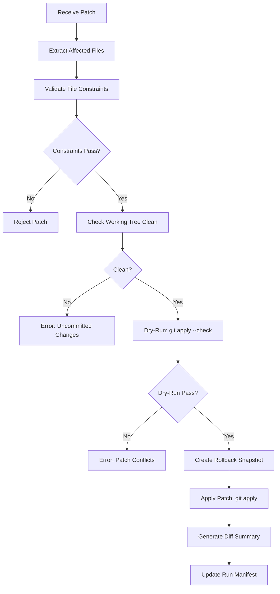

# Patch Application & Git Management Playbook

This playbook provides operational guidance for patch application, branch management, dry-run validation, conflict handling, and resume instructions.

## Table of Contents

1. [Overview](#overview)
2. [Patch Application Workflow](#patch-application-workflow)
3. [Dry-Run Validation](#dry-run-validation)
4. [Constraint Enforcement](#constraint-enforcement)
5. [Branch Management](#branch-management)
6. [Conflict Handling](#conflict-handling)
7. [Rollback Procedures](#rollback-procedures)
8. [Resume Instructions](#resume-instructions)
9. [Troubleshooting](#troubleshooting)

---

## Overview

The Patch Manager and Branch Manager provide safe, deterministic patch application with automatic constraint enforcement, rollback snapshots, and git safety rails.

### Key Components

- **Patch Manager** (`src/workflows/patchManager.ts`): Handles patch validation, application, and rollback
- **Branch Manager** (`src/workflows/branchManager.ts`): Manages feature branches, push operations, and metadata
- **RepoConfig** (`src/core/config/RepoConfig.ts`): Defines allowed/blocked file patterns and governance controls

### Safety Guarantees

1. **Dry-Run First**: All patches are validated with `git apply --check` before application
2. **Constraint Enforcement**: File patterns are checked against allowlist/denylist before any git operations
3. **Rollback Snapshots**: Git state is captured before each patch application
4. **Working Tree Verification**: Patches only apply to clean working trees
5. **Protected Branch Prevention**: Direct commits to main/master/develop are blocked

---

## Patch Application Workflow

### Standard Flow



### Example: Apply a Patch

```typescript
import { applyPatch, type Patch, type PatchConfig } from './workflows/patchManager';
import { loadRepoConfig } from './core/config/RepoConfig';

const patch: Patch = {
  patchId: 'I3.T2-001',
  content: `--- a/src/index.ts
+++ b/src/index.ts
@@ -1,3 +1,4 @@
+import { newFeature } from './feature';
 const app = express();
`,
  description: 'Add new feature import',
};

const repoConfig = loadRepoConfig('.codepipe/config.json').config!;

const config: PatchConfig = {
  runDir: '.codepipe/runs/feat-abc123',
  featureId: 'feat-abc123',
  taskId: 'I3.T2',
  repoConfig,
  workingDir: process.cwd(),
};

const result = await applyPatch(patch, config, logger, metrics);

if (result.success) {
  console.log(`Patch applied successfully!`);
  console.log(`Snapshot: ${result.snapshotPath}`);
  console.log(`Diff Summary: ${result.diffSummaryPath}`);
} else {
  console.error(`Patch failed: ${result.error}`);
  console.error(`Recoverable: ${result.recoverable}`);
}
```

---

## Dry-Run Validation

Dry-run validation performs the following checks **before** modifying any files:

### Validation Steps

1. **Extract Affected Files**
   - Parse unified diff headers (`--- a/file`, `+++ b/file`)
   - Build list of files that will be modified

2. **Constraint Validation**
   - Check each file against `repoConfig.safety.blocked_file_patterns`
   - Check each file matches at least one `repoConfig.safety.allowed_file_patterns`
   - Collect violations with actionable error messages

3. **Working Tree Check**
   - Run `git status --porcelain`
   - Ensure no uncommitted changes exist

4. **Git Apply Check**
   - Write patch to temporary file
   - Run `git apply --check <patch-file>`
   - Capture any conflict or error messages

### Example: Dry-Run Only

```typescript
import { validatePatchDryRun } from './workflows/patchManager';

const dryRunResult = await validatePatchDryRun(patch, workingDir, repoConfig, logger);

if (!dryRunResult.success) {
  console.error('Dry-run validation failed:');
  for (const error of dryRunResult.errors) {
    console.error(`  - ${error}`);
  }

  if (dryRunResult.violations.length > 0) {
    console.error('\nConstraint violations:');
    for (const violation of dryRunResult.violations) {
      console.error(`  - ${violation.file}: ${violation.reason}`);
    }
  }
}
```

---

## Constraint Enforcement

### Allowed File Patterns

Patches can only modify files matching patterns in `repoConfig.safety.allowed_file_patterns`.

**Default patterns:**

```json
{
  "safety": {
    "allowed_file_patterns": ["**/*.ts", "**/*.js", "**/*.md", "**/*.json"]
  }
}
```

### Blocked File Patterns

Patches **cannot** modify files matching patterns in `repoConfig.safety.blocked_file_patterns`.

**Default patterns:**

```json
{
  "safety": {
    "blocked_file_patterns": [".env", "**/*.key", "**/*.pem", "**/credentials.*"]
  }
}
```

### Enforcement Rules

1. **Blocked takes precedence**: If a file matches both allowed and blocked patterns, it is blocked
2. **Explicit violations**: Each violation includes the file path, pattern, and reason
3. **Pre-git validation**: Constraints are checked **before** any git commands execute

### Example: Constraint Violation

```
Patch violates file constraints: 2 violation(s)
  - .env: File matches blocked pattern ".env" from RepoConfig.safety.blocked_file_patterns
  - src/secrets.key: File matches blocked pattern "**/*.key" from RepoConfig.safety.blocked_file_patterns
```

### Customizing Constraints

Edit `.codepipe/config.json`:

```json
{
  "safety": {
    "allowed_file_patterns": ["src/**/*.ts", "tests/**/*.spec.ts", "docs/**/*.md"],
    "blocked_file_patterns": [
      ".env*",
      "**/*.key",
      "**/*.pem",
      "**/credentials.*",
      "node_modules/**",
      ".git/**"
    ]
  }
}
```

---

## Branch Management

### Create Feature Branch

```typescript
import {
  createBranch,
  type BranchConfig,
  type CreateBranchOptions,
} from './workflows/branchManager';

const config: BranchConfig = {
  runDir: '.codepipe/runs/feat-abc123',
  featureId: 'feat-abc123',
  workingDir: process.cwd(),
  repoConfig,
};

const options: CreateBranchOptions = {
  branchPrefix: 'feature/',
  branchName: 'add-user-auth',
  baseBranch: 'main',
  pushToRemote: true,
  remoteName: 'origin',
};

const result = await createBranch(config, options, logger, metrics);

if (result.success) {
  console.log(`Branch created: ${result.branchName}`);
  console.log(`Base SHA: ${result.baseSha}`);
  console.log(`Metadata: ${result.metadataPath}`);
} else {
  console.error(`Branch creation failed: ${result.error}`);
}
```

### Push Branch to Remote

```typescript
import { pushBranch } from './workflows/branchManager';

const pushResult = await pushBranch(config, 'feature/add-user-auth', 'origin', logger, metrics);

if (pushResult.success) {
  console.log(`Branch pushed to: ${pushResult.remoteUrl}`);
  console.log(`Tracking: ${pushResult.trackingBranch}`);
} else {
  console.error(`Push failed: ${pushResult.error}`);
}
```

### Check Branch Sync Status

```typescript
import { getBranchSyncStatus } from './workflows/branchManager';

const syncStatus = await getBranchSyncStatus(config, logger);

console.log(`Branch: ${syncStatus.branchName}`);
console.log(`Tracking: ${syncStatus.trackingBranch}`);
console.log(`Ahead: ${syncStatus.commitsAhead}`);
console.log(`Behind: ${syncStatus.commitsBehind}`);
console.log(`Status: ${syncStatus.status}`);
```

### Branch Naming Conventions

| Prefix        | Use Case            | Example                       |
| ------------- | ------------------- | ----------------------------- |
| `feature/`    | New features        | `feature/user-authentication` |
| `bugfix/`     | Bug fixes           | `bugfix/login-error`          |
| `hotfix/`     | Production hotfixes | `hotfix/security-patch`       |
| `experiment/` | Experimental work   | `experiment/new-ui-design`    |

---

## Conflict Handling

### When Conflicts Occur

Patches fail with `git apply` errors when:

1. **Merge conflicts**: Changed lines overlap with local modifications
2. **Missing context**: Patch expects different surrounding code
3. **File not found**: Patch references files that don't exist

### Detection

The Patch Manager automatically detects conflicts and marks tasks as `human-action-required`:

```json
{
  "status": "paused",
  "execution": {
    "last_error": {
      "step": "I3.T2",
      "message": "git apply failed: error: patch failed: src/index.ts:42",
      "timestamp": "2025-12-17T14:30:00Z",
      "recoverable": true
    }
  }
}
```

### Resolution Steps

1. **Inspect the conflict**

   ```bash
   cd /path/to/repo
   git status
   ```

2. **Review the patch**

   ```bash
   cat .codepipe/runs/feat-abc123/artifacts/patches/I3.T2-001.diff
   ```

3. **Manually resolve conflicts**
   - Edit conflicting files
   - Run tests to verify changes
   - Stage resolved files: `git add <files>`

4. **Resume the workflow**
   ```bash
   codepipe resume --feature-id feat-abc123
   ```

### Manual Patch Application

If automatic application fails, apply patches manually:

```bash
cd /path/to/repo

# Apply the patch with conflict markers
git apply --reject .codepipe/runs/feat-abc123/artifacts/patches/I3.T2-001.diff

# Review reject files
cat src/index.ts.rej

# Manually merge changes
vim src/index.ts

# Stage and commit
git add src/index.ts
git commit -m "Manual patch application for I3.T2-001

[task_id: I3.T2]
[feature_id: feat-abc123]"
```

---

## Rollback Procedures

### Snapshot Structure

Rollback snapshots are created before each patch application:

```
.codepipe/runs/feat-abc123/artifacts/patches/snapshots/
└── snapshot-I3.T2-I3.T2-001-1702823456789.json
```

**Snapshot metadata:**

```json
{
  "schema_version": "1.0.0",
  "snapshot_id": "snapshot-I3.T2-I3.T2-001-1702823456789",
  "feature_id": "feat-abc123",
  "task_id": "I3.T2",
  "patch_id": "I3.T2-001",
  "created_at": "2025-12-17T14:25:00Z",
  "git_ref": "refs/heads/feature/add-user-auth",
  "git_sha": "a1b2c3d4e5f6789012345678901234567890abcd",
  "working_tree_status": "",
  "stashed_changes": false
}
```

### Rollback to Snapshot

```bash
cd /path/to/repo

# Find the snapshot
SNAPSHOT_SHA="a1b2c3d4e5f6789012345678901234567890abcd"

# Hard reset to snapshot SHA
git reset --hard $SNAPSHOT_SHA

# Verify working tree is clean
git status
```

### Automated Rollback

```typescript
import { loadBranchMetadata } from './workflows/branchManager';

const metadata = await loadBranchMetadata(config);
if (metadata?.last_commit_sha) {
  await execAsync(`git reset --hard ${metadata.last_commit_sha}`, {
    cwd: config.workingDir,
  });
  console.log(`Rolled back to ${metadata.last_commit_sha}`);
}
```

---

## Resume Instructions

### When to Resume

Resume the workflow after:

1. **Manual conflict resolution**
2. **Correcting constraint violations**
3. **Fixing blocked file patterns in config**
4. **Resolving git state issues**

### Resume Command

```bash
codepipe resume --feature-id <feature-id>
```

### Resume Workflow

1. **Load run manifest**
   - Read `.codepipe/runs/<feature-id>/manifest.json`
   - Check `status` and `execution.last_error`

2. **Validate state**
   - Ensure working tree is clean
   - Verify last applied patch matches manifest

3. **Continue execution**
   - Resume from next pending task in queue
   - Skip completed tasks
   - Retry failed tasks if marked recoverable

### Manual Resume

If the CLI resume fails, manually continue:

```bash
cd /path/to/repo

# Check current queue state
cat .codepipe/runs/feat-abc123/manifest.json | jq .queue

# List pending tasks
ls .codepipe/runs/feat-abc123/queue/pending/

# Mark task as completed
mv .codepipe/runs/feat-abc123/queue/running/I3.T2.json \
   .codepipe/runs/feat-abc123/queue/completed/
```

---

## Troubleshooting

### Common Issues

#### 1. Working Tree Not Clean

**Error:**

```
Working tree is not clean. Commit or stash changes before applying patches.
```

**Solution:**

```bash
git status
git add .
git commit -m "WIP: checkpoint before patch"
# OR
git stash
```

#### 2. Constraint Violation

**Error:**

```
File matches blocked pattern "**/*.env" from RepoConfig.safety.blocked_file_patterns
```

**Solution:**

- Remove sensitive files from the patch
- Update `.codepipe/config.json` to adjust patterns
- Move sensitive configuration to environment variables

#### 3. Patch Conflicts

**Error:**

```
git apply failed: error: patch failed: src/index.ts:42
```

**Solution:**

- See [Conflict Handling](#conflict-handling) section
- Manually apply patch with `git apply --reject`
- Resolve conflicts and resume workflow

#### 4. Branch Already Exists

**Error:**

```
Branch "feature/add-user-auth" already exists
```

**Solution:**

```bash
# Delete local branch
git branch -d feature/add-user-auth

# OR force delete if unmerged
git branch -D feature/add-user-auth

# Delete remote branch
git push origin --delete feature/add-user-auth
```

#### 5. Protected Branch Commit

**Error:**

```
Cannot commit directly to protected branch: main
```

**Solution:**

- Create a feature branch first
- Never commit directly to `main`, `master`, or `develop`
- Use the Branch Manager to create a proper feature branch

### Diagnostic Commands

```bash
# Check git status
git status --porcelain

# Verify current branch
git rev-parse --abbrev-ref HEAD

# Check for uncommitted changes
git diff HEAD

# View recent commits
git log --oneline -5

# Check remote tracking
git rev-parse --abbrev-ref --symbolic-full-name @{u}

# Verify ahead/behind counts
git rev-list --left-right --count @{u}...HEAD
```

### Log Locations

- **Patch Manager logs**: `.codepipe/runs/<feature-id>/logs/patch-manager.ndjson`
- **Branch Manager logs**: `.codepipe/runs/<feature-id>/logs/branch-manager.ndjson`
- **Diff summaries**: `.codepipe/runs/<feature-id>/artifacts/patches/<patch-id>-summary.json`
- **Rollback snapshots**: `.codepipe/runs/<feature-id>/artifacts/patches/snapshots/`

---

## References

- FR-12: Execution Task Generation & Safe Patch Application
- FR-13: Git Constraints Enforcement & Dependency Management
- ADR-3: Git Safety Rails & Integration Patterns
- `src/workflows/patchManager.ts`: Patch Manager implementation
- `src/workflows/branchManager.ts`: Branch Manager implementation
- `src/core/config/RepoConfig.ts`: Configuration schema
- `docs/reference/config/codemachine_adapter_guide.md`: Configuration documentation
