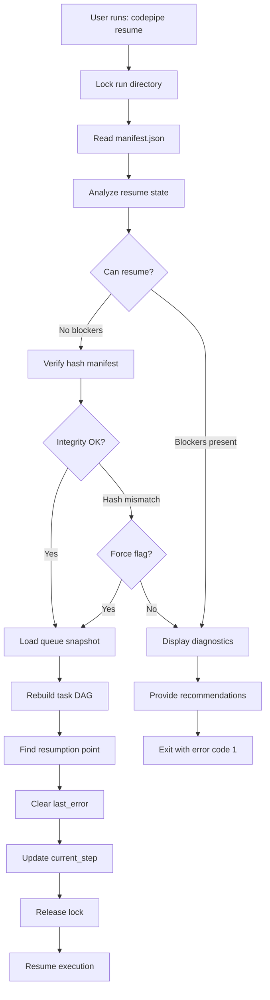

# Resume Playbook

**Version:** 1.1.0
**Last Updated:** 2026-03-18
**Owner:** Platform Engineering

---

## Overview

This playbook provides comprehensive guidance for resuming failed or paused AI Feature Pipeline runs. It maps error classifications to recovery actions, explains the resume coordinator's diagnostic system, and documents manual intervention procedures.

### Architecture (v1.1.0)

The resume system is decomposed into four modules:

- **`resumeCoordinator.ts`** — top-level coordinator that orchestrates the resume flow
- **`runStateVerifier.ts`** — verifies run state consistency before resuming
- **`resumeIntegrityChecker.ts`** — validates artifact integrity (manifests, hashes)
- **`resumeQueueRecovery.ts`** — recovers queue state for interrupted queue operations

The coordinator delegates to the integrity checker and state verifier before
attempting any task re-execution. If queue operations were interrupted, the
queue recovery module restores queue state from the persisted queue artifacts
and revalidates consistency before continuing.

### Key Principles

1. **Determinism**: Resume operations must be idempotent and reproducible
2. **Safety First**: Never resume if artifact integrity is compromised
3. **Transparency**: Provide clear diagnostics and recovery paths
4. **Auditability**: Log all resume attempts and outcomes

---

## Table of Contents

1. [Failure Taxonomy](#failure-taxonomy)
2. [Resume Workflow](#resume-workflow)
3. [Diagnostic Codes](#diagnostic-codes)
4. [Recovery Procedures](#recovery-procedures)
5. [CLI Commands](#cli-commands)
6. [Troubleshooting](#troubleshooting)

---

## Failure Taxonomy

The Resume Coordinator classifies failures into categories with specific recovery strategies.

### 1. Recoverable Errors

**Characteristics**: Transient failures that can be retried automatically

#### ERROR_RATE_LIMIT

**Cause**: API rate limit exceeded
**Recovery**: Automatic (after rate limit reset)

**Human Actions**:

- Wait for rate limit window to reset
- Review rate limit budgets in `.codepipe/config.json`
- Consider increasing retry delays in config

**Agent Actions**:

- Exponential backoff with jitter
- Resume after `retry_after_seconds` expires
- Continue from last checkpoint

---

#### ERROR_NETWORK

**Cause**: Network timeout, connection refused, DNS failure
**Recovery**: Automatic retry with backoff

**Human Actions**:

- Verify network connectivity: `ping api.anthropic.com` or relevant endpoint
- Check firewall/proxy settings
- Confirm VPN status if required

**Agent Actions**:

- Retry up to `max_retries` with exponential backoff
- Log network diagnostics to `logs/network_errors.ndjson`
- Resume from last completed step

---

#### ERROR_VALIDATION

**Cause**: Schema validation failure, invalid input artifact
**Recovery**: Manual or automatic (depends on root cause)

**Human Actions**:

- Inspect failed artifact in run directory (e.g., `artifacts/spec.md`)
- Run `codepipe validate <feature_id>` to identify issues
- If input was manually edited, restore from hash manifest or regenerate

**Agent Actions**:

- If validation is for generated output: retry task with adjusted prompts
- If validation is for persisted state: halt and require manual intervention
- Log validation errors to `logs/validation_errors.ndjson`

---

### 2. Blocking Errors

**Characteristics**: Require manual intervention before resume

#### ERROR_CORRUPTION

**Cause**: Hash manifest verification failed, artifacts modified externally
**Recovery**: Manual restoration required

**Human Actions**:

1. Check integrity report: `codepipe resume --dry-run <feature_id>`
2. Review failed files in diagnostics output
3. Restore from backup or regenerate:
   - If source artifacts (PRD, spec) were corrupted: restore from git history
   - If queue files corrupted: delete and rebuild from plan
4. Run `codepipe verify <feature_id>` to confirm integrity
5. Resume with `codepipe resume <feature_id>`

**Agent Actions**:

- **HALT**: Do not proceed with corrupted state
- Log corruption details to `logs/integrity_failures.ndjson`
- Await human intervention

---

#### ERROR_PERMISSION

**Cause**: Insufficient permissions (git, filesystem, API keys)
**Recovery**: Manual permission grant required

**Human Actions**:

1. Identify permission failure from error message
2. For Git permissions:
   - Verify SSH keys: `ssh -T git@github.com`
   - Check branch protection rules
   - Ensure user has write access to repository
3. For API permissions:
   - Verify API keys in `.env` or secrets manager
   - Check API key scopes/permissions
   - Rotate keys if expired
4. For filesystem permissions:
   - Check run directory ownership: `ls -la .codepipe/runs/<feature_id>`
   - Fix with: `sudo chown -R $USER:$USER .codepipe`

**Agent Actions**:

- **HALT**: Do not retry without permission changes
- Log permission error details
- Provide specific permission requirements in diagnostics

---

#### APPROVALS_PENDING

**Cause**: Human approval checkpoint not cleared
**Recovery**: Manual approval required

**Human Actions**:

1. Review pending approvals: `codepipe status <feature_id>`
2. Inspect approval details in `approvals/approvals.json`
3. Grant approval:
   ```bash
   codepipe approve <feature_id> --type <approval_type>
   ```
4. Resume: `codepipe resume <feature_id>`

**Agent Actions**:

- **HALT**: Cannot proceed without approval
- Display pending approval types in diagnostics
- Provide approval instructions in recommendations

---

#### ERROR_GIT

**Cause**: Merge conflicts, detached HEAD, uncommitted changes
**Recovery**: Manual git resolution required

**Human Actions**:

1. Navigate to repository root
2. Check git status: `git status`
3. For merge conflicts:
   ```bash
   git status                    # Identify conflicted files
   # Resolve conflicts manually
   git add <resolved_files>
   git merge --continue
   ```
4. For detached HEAD:
   ```bash
   git checkout <branch_name>    # Or create new branch
   ```
5. For uncommitted changes:
   ```bash
   git stash                     # Save WIP
   # Or commit changes
   ```
6. Resume: `codepipe resume <feature_id>`

**Agent Actions**:

- **HALT**: Git state must be clean before code generation
- Log git diagnostics to `logs/git_errors.ndjson`
- Suggest resolution commands in diagnostics

---

### 3. Non-Recoverable Errors

**Characteristics**: Structural failures requiring re-planning or manual fixes

#### NON_RECOVERABLE_ERROR

**Cause**: Agent failure, malformed plan, logic errors
**Recovery**: Requires replanning or manual code fix

**Human Actions**:

1. Review error context in `manifest.json` → `execution.last_error`
2. Check logs: `logs.ndjson` filtered by `feature_id`
3. Decide recovery strategy:
   - **Option A**: Fix manually and mark task completed
     ```bash
     codepipe task complete <feature_id> <task_id>
     ```
   - **Option B**: Regenerate plan
     ```bash
     codepipe replan <feature_id>
     ```
   - **Option C**: Abort and restart
     ```bash
     codepipe abort <feature_id>
     codepipe start <new_feature_id> --from-linear <issue_id>
     ```

**Agent Actions**:

- **HALT**: Mark run as `failed` with `recoverable: false`
- Log full error context including stack traces
- Provide manual intervention guidance

---

### 4. Status-Based Conditions

#### ALREADY_COMPLETED

**Condition**: Run status is `completed`
**Recovery**: None needed (informational)

**Human Actions**:

- Verify completion: `codepipe status <feature_id>`
- If PR not created, manually trigger: `codepipe pr create <feature_id>`

---

#### PAUSED

**Condition**: Run status is `paused` (intentional pause)
**Recovery**: Standard resume

**Human Actions**:

- Resume: `codepipe resume <feature_id>`

---

#### UNEXPECTED_INTERRUPT

**Condition**: Run status is `in_progress` but no active process
**Recovery**: Safe resume (checks for partial writes)

**Human Actions**:

1. Verify no other process is running: `ps aux | grep codepipe`
2. Check for stale lock: `ls -la .codepipe/runs/<feature_id>/run.lock`
3. Resume (lock will auto-clear if stale): `codepipe resume <feature_id>`

**Agent Actions**:

- Verify artifact integrity before resuming
- Check queue for partially written tasks
- Resume from last confirmed checkpoint

---

## Resume Workflow

### Standard Resume Process



### Resume State Machine

| Current Status | Conditions            | Resume Action                            |
| -------------- | --------------------- | ---------------------------------------- |
| `pending`      | No tasks started      | Start execution from beginning           |
| `in_progress`  | Unexpected interrupt  | Verify integrity → resume from last_step |
| `paused`       | No errors             | Resume from last_step                    |
| `paused`       | Recoverable error     | Clear error → resume from last_step      |
| `failed`       | Recoverable error     | Clear error → retry failed task          |
| `failed`       | Non-recoverable error | **BLOCK** → manual intervention          |
| `completed`    | N/A                   | **BLOCK** → informational message        |

---

## Diagnostic Codes

The Resume Coordinator emits diagnostic codes for playbook mapping:

### Informational Codes

- `PAUSED`: Run is paused, ready to resume
- `NOT_STARTED`: Run has not begun execution
- `ALREADY_COMPLETED`: Run completed successfully
- `INTEGRITY_OK`: All artifacts passed hash verification
- `QUEUE_COMPLETE`: All queue tasks completed
- `QUEUE_HAS_PENDING`: Tasks remaining in queue
- `QUEUE_VALIDATED`: Queue files passed validation checks

### Warning Codes

- `RECOVERABLE_ERROR`: Error is transient and retryable
- `UNEXPECTED_INTERRUPT`: Process crashed unexpectedly
- `INTEGRITY_NO_MANIFEST`: Hash manifest not found (early failure)
- `QUEUE_HAS_FAILURES`: Some tasks failed but may be retryable
- `QUEUE_VALIDATION_WARNINGS`: Queue validation surfaced warnings (checksum mismatch, manifest missing)

### Error Codes

- `ERROR_RATE_LIMIT`: API rate limit exceeded
- `ERROR_NETWORK`: Network connectivity failure
- `ERROR_VALIDATION`: Schema or input validation failed
- `ERROR_PERMISSION`: Insufficient permissions
- `ERROR_GIT`: Git repository state issue
- `ERROR_AGENT`: Agent execution failure
- `ERROR_CORRUPTION`: Artifact integrity compromised
- `ERROR_UNKNOWN`: Unclassified error

### Blocker Codes

- `NON_RECOVERABLE_ERROR`: Structural failure requiring manual fix
- `APPROVALS_PENDING`: Human approval required
- `INTEGRITY_HASH_MISMATCH`: Artifact hash verification failed
- `INTEGRITY_MISSING_FILES`: Expected artifacts missing
- `QUEUE_DIR_MISSING`: Queue directory not configured
- `QUEUE_CORRUPTED`: Queue files failed validation (corrupted JSON, schema mismatch)

---

## Recovery Procedures

### Procedure 1: Rate Limit Recovery

**Scenario**: Agent hit API rate limit during execution

**Steps**:

1. Check rate limit status:
   ```bash
   codepipe status <feature_id> --verbose
   ```
2. Review telemetry for reset time:
   ```bash
   cat .codepipe/runs/<feature_id>/telemetry/costs.json | jq '.rate_limits'
   ```
3. Wait for reset window or adjust config:
   ```json
   // .codepipe/config.json
   {
     "rate_limits": {
       "anthropic": {
         "requests_per_minute": 50, // Lower this
         "retry_after_seconds": 60
       }
     }
   }
   ```
4. Resume:
   ```bash
   codepipe resume <feature_id>
   ```

**Automation**: Agent auto-retries with exponential backoff

---

### Procedure 2: Hash Integrity Failure

**Scenario**: Artifacts modified externally, hash verification fails

**Steps**:

1. Inspect integrity report:
   ```bash
   codepipe resume --dry-run <feature_id>
   ```
2. Identify failed artifacts in diagnostics output
3. Restore options:
   - **Option A**: Restore from git
     ```bash
     cd <repo_root>
     git checkout HEAD -- <modified_file>
     ```
   - **Option B**: Regenerate hash manifest (if changes are intentional)
     ```bash
     codepipe hash-manifest regenerate <feature_id>
     ```
   - **Option C**: Force resume (dangerous)
     ```bash
     codepipe resume <feature_id> --force
     ```
4. Verify and resume:
   ```bash
   codepipe verify <feature_id>
   codepipe resume <feature_id>
   ```

**When to use --force**:

- You manually edited artifacts and verified correctness
- Development/testing only (never in production pipelines)

---

### Procedure 3: Queue Corruption

**Scenario**: Queue files contain corrupted entries

**Steps**:

1. Validate queue:
   ```bash
   codepipe queue validate <feature_id>
   ```
2. Review corruption report (shows line numbers and errors)
3. Rebuild queue from plan:
   ```bash
   codepipe queue rebuild <feature_id> --from-plan
   ```
4. Verify rebuild:
   ```bash
   codepipe queue validate <feature_id>
   ```
5. Resume:
   ```bash
   codepipe resume <feature_id>
   ```

**Prevention**:

- Always use `withLock()` when writing queue files
- Enable queue snapshots for faster recovery
- Resume diagnostics emit `QUEUE_CORRUPTED` when this workflow is required and `QUEUE_VALIDATION_WARNINGS` when manual review is recommended.

---

### Procedure 4: Pending Approvals

**Scenario**: Human approval checkpoint blocks resume

**Steps**:

1. List pending approvals:
   ```bash
   codepipe status <feature_id>
   ```
2. Review approval context:
   ```bash
   cat .codepipe/runs/<feature_id>/approvals/approvals.json
   ```
3. Approve if satisfied:
   ```bash
   codepipe approve <feature_id> --type spec_review
   ```
4. Resume:
   ```bash
   codepipe resume <feature_id>
   ```

**Common Approval Types**:

- `prd_review`: Product requirements document review
- `spec_review`: Technical specification review
- `plan_review`: Execution plan review
- `code_review`: Generated code review (before commit)
- `pre_deployment`: Final approval before deployment

---

## CLI Commands

### Resume Commands

#### Basic Resume

```bash
codepipe resume <feature_id>
```

Resume execution from last checkpoint.

---

#### Dry Run (Diagnostics Only)

```bash
codepipe resume --dry-run <feature_id>
```

Analyze resume eligibility without executing. Shows:

- Current status
- Last step and error
- Queue state
- Integrity check results
- Diagnostics and recommendations

---

#### Force Resume

```bash
codepipe resume --force <feature_id>
```

⚠️ **Dangerous**: Override blockers (integrity failures, warnings). Use only when:

- You've manually verified artifact correctness
- In development environments
- After consulting this playbook

---

#### Skip Hash Verification

```bash
codepipe resume --skip-hash-verification <feature_id>
```

⚠️ **Dangerous**: Skip artifact integrity checks. Use only for debugging.

---

### Supporting Commands

#### Verify Integrity

```bash
codepipe verify <feature_id>
```

Check artifact integrity against hash manifest.

---

#### Validate Queue

```bash
codepipe queue validate <feature_id>
```

Validate queue file integrity and schema compliance.

---

#### Rebuild Queue

```bash
codepipe queue rebuild <feature_id> --from-plan
```

Rebuild queue from execution plan (discards current queue state).

---

#### Approve Checkpoint

```bash
codepipe approve <feature_id> --type <approval_type>
```

Grant approval for pending checkpoint.

---

#### Task Management

```bash
# Mark task completed manually
codepipe task complete <feature_id> <task_id>

# Mark task failed
codepipe task fail <feature_id> <task_id> --reason "Manual intervention required"

# Retry specific task
codepipe task retry <feature_id> <task_id>
```

---

## Troubleshooting

### Issue: Resume fails with "Lock timeout"

**Cause**: Another process holds the lock or stale lock exists

**Solution**:

1. Check for running processes:
   ```bash
   ps aux | grep codepipe
   ```
2. If no processes, check lock file:
   ```bash
   cat .codepipe/runs/<feature_id>/run.lock
   ```
3. If lock is stale (>60 seconds old and process doesn't exist):
   - Lock will auto-clear on next attempt
   - Or manually remove (use with caution):
     ```bash
     rm .codepipe/runs/<feature_id>/run.lock
     ```

---

### Issue: Resume says "already completed" but PR not created

**Cause**: PR creation task failed after code generation

**Solution**:

1. Check queue for failed tasks:
   ```bash
   codepipe queue list <feature_id> --status failed
   ```
2. If PR task failed, retry:
   ```bash
   codepipe task retry <feature_id> <pr_task_id>
   ```
3. Or create PR manually:
   ```bash
   codepipe pr create <feature_id>
   ```

---

### Issue: Hash verification fails but files look correct

**Cause**: Line ending differences (CRLF vs LF) or whitespace

**Solution**:

1. Check git attributes:
   ```bash
   cat .gitattributes
   ```
2. Normalize line endings:
   ```bash
   git add --renormalize .
   ```
3. Regenerate hash manifest:
   ```bash
   codepipe hash-manifest regenerate <feature_id>
   ```

---

### Issue: Queue reports more tasks than plan

**Cause**: Queue file manually edited or corrupted

**Solution**:

1. Validate queue:
   ```bash
   codepipe queue validate <feature_id>
   ```
2. If corrupted, rebuild:
   ```bash
   codepipe queue rebuild <feature_id> --from-plan
   ```

---

## Best Practices

### For Operators

1. **Always use --dry-run first**

   ```bash
   codepipe resume --dry-run <feature_id>
   ```

   Review diagnostics before resuming.

2. **Monitor telemetry during resume**

   ```bash
   tail -f .codepipe/runs/<feature_id>/logs/logs.ndjson
   ```

3. **Create snapshots before risky operations**

   ```bash
   codepipe queue snapshot <feature_id>
   ```

4. **Document manual interventions**
   Add notes to run metadata:
   ```bash
   codepipe metadata set <feature_id> manual_fix "Resolved merge conflict in src/app.ts"
   ```

### For Developers

1. **Wrap queue mutations in locks**

   ```typescript
   await withLock(
     runDir,
     async () => {
       await appendToQueue(runDir, tasks);
     },
     { operation: 'add_tasks' }
   );
   ```

2. **Always set recoverable flag correctly**

   ```typescript
   await setLastError(
     runDir,
     'code_generation',
     'Rate limit exceeded',
     true // recoverable
   );
   ```

3. **Create queue snapshots periodically**

   ```typescript
   if (Date.now() - lastSnapshotTime > SNAPSHOT_INTERVAL_MS) {
     await createQueueSnapshot(runDir);
   }
   ```

4. **Validate inputs before processing**
   ```typescript
   const validation = await validateQueue(runDir);
   if (!validation.valid) {
     throw new Error(`Corrupted queue: ${validation.errors[0].message}`);
   }
   ```

---

## Appendix: Failure Statistics

Track failure patterns to improve system resilience:

```bash
# Aggregate failures by error code
cat .codepipe/runs/*/manifest.json | \
  jq -r '.execution.last_error | select(. != null) | .message' | \
  sort | uniq -c | sort -rn

# Identify most common blockers
cat .codepipe/runs/*/manifest.json | \
  jq -r 'select(.status == "failed") | .execution.last_error.message'
```

**Common Patterns** (update quarterly):

- 45% rate limits (improve backoff strategy)
- 30% validation errors (improve prompt engineering)
- 15% network failures (add retry logic)
- 10% git conflicts (improve branch management)

---

## Related Documentation

- [Run Directory Schema](../reference/run_directory_schema.md)
- [Data Model Dictionary](../reference/data_model_dictionary.md)
- [Execution Flow](../reference/architecture/execution_flow.md)
- [Validation Playbook](./validation_playbook.md)

---

**Document Control**
**Version History**:

- 1.0.0 (2025-01-XX): Initial release
