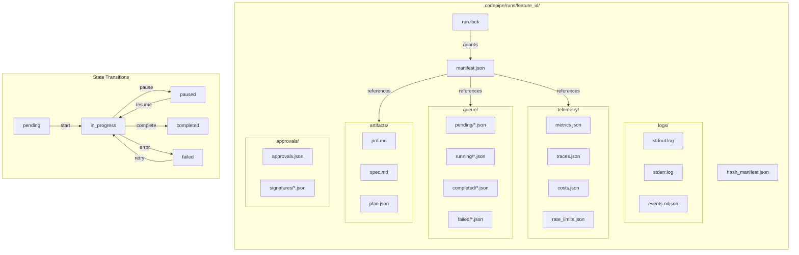
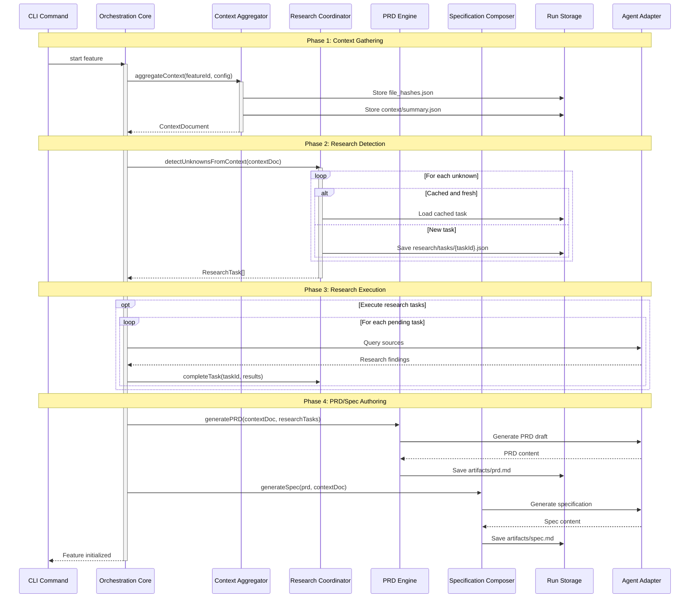
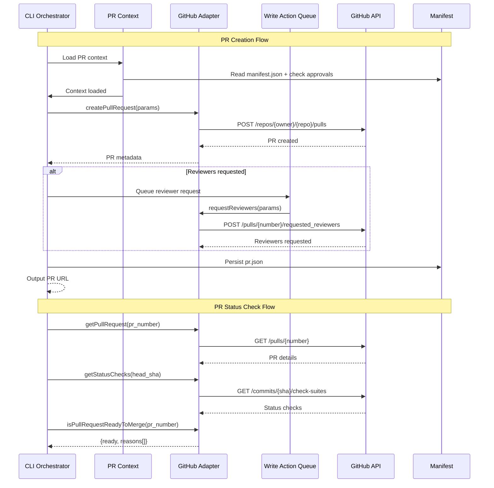
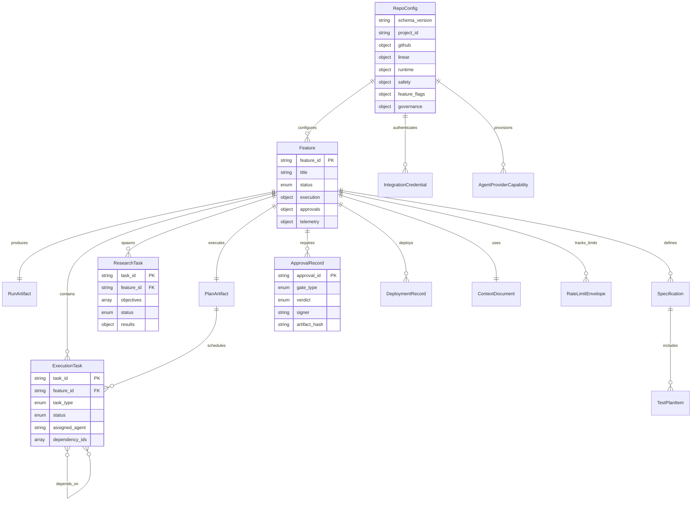

# Architecture Component Index

**Version:** 1.0.0
**Status:** Active
**Last Updated:** 2026-02-11

## Overview

This index provides a centralized navigation hub for all architecture artifacts in the AI Feature Pipeline project. It catalogs diagrams, schemas, specifications, and architectural decision records (ADRs), enabling developers and reviewers to quickly locate relevant documentation.

## Purpose

The Component Index serves as:

- **Discovery Hub:** Single source of truth for architecture documentation
- **Maintenance Guide:** Instructions for updating diagrams and schemas
- **Quality Gate:** Checklist for ensuring documentation completeness
- **Onboarding Aid:** Structured path for new team members to learn system architecture

---

## Architecture Artifacts Catalog

### 1. Diagrams

#### 1.1 Component Overview Diagram

**File:** [`docs/diagrams/component_overview.puml`](../../diagrams/component_overview.puml)

**Documentation:** [`docs/diagrams/component_overview.md`](../../diagrams/component_overview.md)

**Description:** High-level system architecture showing CLI, orchestration services, adapters, persistence, and observability layers with dependencies and extension points.

**Format:** PlantUML (`.puml`)

**Status:** ✅ Active (v1.0.0)

**Last Updated:** 2025-12-15

**Iteration:** I1 (Iteration 1 - Foundation)

**Covers:**

- CLI Presentation Layer (oclif commands)
- Orchestration Core (Context, Research, PRD, Spec, Task Planning, Execution, Resume, Validation)
- Adapter Boundary Layer (GitHub, Linear, Agent, Git, Deployment, Notification, HTTP Client)
- Persistence & Storage Layer (Run Directory Manager, Artifact Bundle, File System)
- Observability & Security (Observability Hub, Security Vault, Telemetry Writers)
- External Systems (GitHub API, Linear API, Agent Providers, Git Repository)

**ADR References:** ADR-1, ADR-2, ADR-3, ADR-4

**Rendering Instructions:** See [How to Render Diagrams](#how-to-render-diagrams) below.

---

#### 1.2 Run Directory Schema Diagram

**File:** [`docs/diagrams/run_directory_schema.mmd`](../../diagrams/run_directory_schema.mmd)

**Documentation:** [`docs/reference/run_directory_schema.md`](../run_directory_schema.md)

**Description:** Mermaid diagram visualizing the `.codepipe/runs/<feature_id>/` directory structure, including manifest files, artifacts, queue, logs, telemetry, approvals, SQLite indexes, and context caches.

**Format:** Mermaid (`.mmd`) | **Status:** ✅ Active (v1.0.0) | **ADR:** ADR-2

<details>
<summary>Run Directory Schema (click to expand)</summary>



</details>

---

#### 1.3 Sequence Diagrams

**Status:** ✅ Active

##### Context & Research Sequence

> From [`docs/diagrams/context_research_sequence.mmd`](../../diagrams/context_research_sequence.mmd).

<details>
<summary>Context & Research Sequence (click to expand)</summary>



</details>

##### PR Automation Sequence

> From [`docs/diagrams/pr_automation_sequence.mmd`](../../diagrams/pr_automation_sequence.mmd).

<details>
<summary>PR Automation Sequence (click to expand)</summary>



</details>

##### Data Model ERD

> From [`docs/diagrams/data_model.mmd`](../../diagrams/data_model.mmd).

<details>
<summary>Data Model ERD (click to expand)</summary>



</details>

#### 1.4 Component Overview (PlantUML)

**File:** [`docs/diagrams/component_overview.puml`](../../diagrams/component_overview.puml)

**Render online:** [PlantUML Server](http://www.plantuml.com/plantuml/uml/) (paste file contents)

**Note:** This diagram uses PlantUML's layered package syntax which cannot be represented in Mermaid. View the source file or render online.

---

### 2. Schemas and Specifications

#### 2.1 Run Directory Schema

**File:** [`docs/reference/run_directory_schema.md`](../run_directory_schema.md)

**Diagram:** [`docs/diagrams/run_directory_schema.mmd`](../../diagrams/run_directory_schema.mmd)

**Description:** Comprehensive specification of the deterministic run directory structure, including manifest schemas, file formats, state machines, locking strategies, and cleanup policies.

**Version:** 1.0.0

**Status:** ✅ Active

**Last Updated:** 2025-12-15

**Covers:**

- Directory structure and file organization
- manifest.json schema (status, execution, approvals, queue, telemetry)
- hash_manifest.json schema (integrity tracking)
- run.lock mechanism (concurrent access protection)
- Subdirectory specifications (artifacts, queue, logs, telemetry, approvals, sqlite, context)
- State machine transitions
- Cleanup and retention policies
- API reference (runDirectoryManager.ts functions)

**Related Diagrams:** `run_directory_schema.mmd`

**ADR References:** ADR-2 (State Persistence)

---

#### 2.2 RepoConfig Schema

**Status:** ✅ Active

**File:** [`docs/reference/config/RepoConfig_schema.md`](../config/RepoConfig_schema.md)

**API Reference:** [`docs/reference/api/api-reference.md`](../api/api-reference.md)

**Description:** Specification for `.codepipe/config.json` schema, including integration settings (GitHub, Linear, agents), validation policies, and governance metadata. Full field-level documentation with types, defaults, and environment variable overrides.

**ADR References:** ADR-2 (State Persistence), ADR-3 (Adapter Boundary), ADR-7 (Validation Policy)

---

#### 2.3 Rate Limit Ledger Schema

**File:** [`docs/reference/cli/rate_limit_reference.md`](../cli/rate_limit_reference.md)

**Description:** Operational reference for rate limit handling, ledger schema (`rate_limits.json`), retry logic, cooldown states, and operator troubleshooting guidance.

**Version:** 1.0.0

**Status:** ✅ Active

**Last Updated:** 2025-12-15

**Covers:**

- Rate limit ledger schema (providers, envelopes, state, cooldown)
- Rate limit header extraction (GitHub, Linear, custom)
- Retry logic and exponential backoff
- Cooldown states and escalation
- Operator actions (inspect, clear, verify tokens)
- HTTP client configuration

**Related Implementation:** `src/adapters/http/client.ts`, `src/telemetry/rateLimitLedger.ts`

**ADR References:** ADR-3 (Adapter Boundary), ADR-2 (State Persistence)

---

### 3. Architectural Decision Records (ADRs)

**Existing ADR Files:**

- [`docs/adr/ADR-6-linear-integration.md`](../../adr/ADR-6-linear-integration.md) - Linear integration strategy and adapter design
- [`docs/adr/ADR-7-validation-policy.md`](../../adr/ADR-7-validation-policy.md) - Zod runtime validation policy

**Planned ADR Files:**

- `docs/adr/ADR-1-agent-execution.md` - Agent execution patterns and task delegation
- `docs/adr/ADR-2-state-persistence.md` - Run directory structure and resumability
- `docs/adr/ADR-3-adapter-boundary.md` - Adapter interfaces and provider abstraction
- `docs/adr/ADR-4-context-gathering.md` - Context aggregation strategies
- `docs/adr/ADR-5-approval-workflows.md` - Human approval gates and validation policies

**Note:** ADR-1 through ADR-5 are referenced in diagrams and documentation but not yet created as standalone files. ADR-6 and ADR-7 are active and accepted.

---

### 4. Blueprint Documents

#### 4.1 Blueprint Foundation

**Generated Artifact (not committed):** `.codemachine/artifacts/architecture/01_Blueprint_Foundation.md`

**Anchor:** `4-0-the-blueprint`

**Description:** Foundational architecture document defining core principles, system overview, pipeline stages, and key components/services.

**Covers:**

- System overview and pipeline stages
- Core architectural principle (Separation of Concerns)
- Key Components/Services catalog (20+ components)
- Component responsibilities and boundaries

**Status:** ✅ Active (generated during runs; not committed to this repo)

---

#### 4.2 System Structure and Data

**Generated Artifact (not committed):** `.codemachine/artifacts/architecture/02_System_Structure_and_Data.md`

**Anchors:** `3-1-architectural-style`, `3-2-technology-stack-summary`

**Description:** Architectural style definition and comprehensive technology stack summary.

**Covers:**

- Architectural style (Modular Layered Orchestrator with Pluggable Adapters)
- Technology stack per layer (CLI, Orchestration, HTTP, Adapters, Persistence, Observability, Validation, Containerization, Distribution)

**Status:** ✅ Active (generated during runs; not committed to this repo)

---

### 5. Operational Guides

#### 5.1 Rate Limit Reference

**File:** [`docs/reference/cli/rate_limit_reference.md`](../cli/rate_limit_reference.md)

**Description:** Operational guide for rate limit monitoring, troubleshooting, and manual intervention.

**Version:** 1.0.0

**Status:** ✅ Active

**Target Audience:** Operators, SREs, developers debugging rate limit issues

---

---

## How to Render Diagrams

### PlantUML Diagrams (.puml)

**Prerequisites:**

- Java Runtime Environment (JRE) 8+
- PlantUML JAR or CLI

**Local Rendering:**

```bash
# Using PlantUML JAR
java -jar plantuml.jar docs/diagrams/component_overview.puml

# Using PlantUML CLI (via Homebrew/apt)
plantuml docs/diagrams/component_overview.puml

# Output: component_overview.png in same directory
```

**VSCode Extension:**

1. Install "PlantUML" extension by jebbs
2. Open `.puml` file
3. Press `Alt+D` (Windows/Linux) or `Option+D` (Mac)

**Online Rendering:**

1. Visit [PlantUML Online Editor](http://www.plantuml.com/plantuml/uml/)
2. Paste `.puml` contents
3. View rendered diagram

---

### Mermaid Diagrams (.mmd)

**GitHub Native Rendering:**

- GitHub automatically renders `.mmd` files when viewed in browser
- Click on `run_directory_schema.mmd` in GitHub web interface

**VSCode Extension:**

1. Install "Markdown Preview Mermaid Support" extension
2. Open markdown file referencing mermaid diagram
3. Preview markdown to see rendered diagram

**Mermaid Live Editor:**

1. Visit [Mermaid Live Editor](https://mermaid.live/)
2. Paste `.mmd` contents
3. View and export diagram

---

### CI-Based Rendering (Future)

**Planned npm Script:**

```bash
npm run diagrams
```

**Behavior:**

- Scans `docs/diagrams/*.puml` and `docs/diagrams/*.mmd`
- Renders to PNG/SVG in `docs/diagrams/exports/`
- Validates PlantUML/Mermaid syntax
- Fails CI if syntax errors detected

**GitHub Actions Workflow (Future):**

- Triggers on push to `main` or PR to `main`
- Renders all diagrams
- Commits exports to `docs/diagrams/exports/`
- Provides diff preview in PR comments

---

## Maintenance Guidelines

### When to Update Architecture Documentation

Update architecture artifacts when:

1. **Adding New Components:** New services, adapters, or modules
2. **Modifying Component Responsibilities:** Changes to what a component does
3. **Changing Dependencies:** New relationships between components
4. **Adding Extension Points:** New plugin/adapter interfaces
5. **Deprecating Components:** Removing or replacing existing modules
6. **Significant Refactoring:** Architectural boundary changes
7. **New ADR Decisions:** Documenting architectural choices

---

### Diagram Update Checklist

When modifying system architecture, use this checklist:

#### Adding New Components

- [ ] Add component to `component_overview.puml`
- [ ] Add component description to `component_overview.md`
- [ ] Update Component Responsibilities Matrix
- [ ] Add dependency arrows in diagram
- [ ] Document extension point if applicable
- [ ] Update this index with new component
- [ ] Create or update related ADR
- [ ] Render and verify diagram output

#### Modifying Existing Components

- [ ] Update component in `component_overview.puml`
- [ ] Revise component documentation in `component_overview.md`
- [ ] Update dependency arrows if changed
- [ ] Review ADR references for accuracy
- [ ] Update Component Responsibilities Matrix
- [ ] Render and verify diagram output

#### Adding New Adapters

- [ ] Add adapter to Adapter Boundary Layer in `component_overview.puml`
- [ ] Document adapter in `component_overview.md` (Section 3)
- [ ] Add HTTP Client dependency (if applicable)
- [ ] Document extension point
- [ ] Update Blueprint Section 4.0
- [ ] Create or update ADR-3 addendum
- [ ] Render and verify diagram output

#### Adding New Diagrams

- [ ] Create diagram file in `docs/diagrams/`
- [ ] Create companion documentation in `docs/diagrams/` or `docs/reference/`
- [ ] Add entry to this index (Section 1 or 2)
- [ ] Include rendering instructions
- [ ] Reference related ADRs
- [ ] Cross-link from `component_overview.md` if related
- [ ] Verify diagram renders correctly
- [ ] Update blueprint if authoritative changes

#### Creating ADRs

- [ ] Create ADR file in `docs/adr/`
- [ ] Follow ADR template (decision, context, consequences)
- [ ] Reference ADR in relevant diagrams (`[[ADR-N]]`)
- [ ] Update this index ADR section
- [ ] Link from `component_overview.md` Component Responsibilities Matrix
- [ ] Add ADR to blueprint references if applicable

---

### Schema Update Checklist

When modifying run directory, config, or telemetry schemas:

- [ ] Update schema specification document (e.g., `run_directory_schema.md`)
- [ ] Update related diagram if applicable (e.g., `run_directory_schema.mmd`)
- [ ] Bump schema version (semver)
- [ ] Document migration path if breaking change
- [ ] Update API reference section
- [ ] Update example JSON structures
- [ ] Update related ADR if architectural
- [ ] Test schema validation (Zod, JSON Schema)
- [ ] Update this index with version/date

---

### Documentation Quality Standards

All architecture artifacts must meet these standards:

1. **Version Header:** Include version, status, and last updated date
2. **Cross-References:** Link to related diagrams, schemas, and ADRs
3. **ADR Traceability:** Reference relevant ADRs explicitly
4. **Change Log:** Maintain version history table
5. **Rendering Instructions:** Include how to view/render diagrams
6. **Maintenance Guidance:** Checklist or instructions for updates
7. **Anchor Tags:** Use HTML anchors for deep linking
8. **Code Examples:** Include realistic examples where applicable
9. **Status Indicators:** Use ✅ Active, 🚧 Planned, ⚠️ Deprecated
10. **Blueprint Alignment:** Ensure consistency with authoritative blueprint

---

## Navigation Quick Links

### By Role

**Architects / Technical Leads:**

- [Component Overview Diagram](../../diagrams/component_overview.puml) - System architecture
- Blueprint Foundation (generated: `.codemachine/artifacts/architecture/01_Blueprint_Foundation.md`) - Core principles
- ADRs (pending upload) - Architectural decisions

**Backend Developers:**

- [Component Overview Diagram](../../diagrams/component_overview.puml) - Module boundaries
- [Run Directory Schema](../run_directory_schema.md) - Persistence layer
- [Rate Limit Reference](../cli/rate_limit_reference.md) - HTTP layer

**DevOps / SREs:**

- [Rate Limit Reference](../cli/rate_limit_reference.md) - Operational troubleshooting
- [Run Directory Schema](../run_directory_schema.md) - State persistence
- Cleanup policies (future) - Retention management

**New Team Members:**

1. Start with [Component Overview Documentation](../../diagrams/component_overview.md)
2. Review Blueprint Foundation (generated: `.codemachine/artifacts/architecture/01_Blueprint_Foundation.md`)
3. Explore [Run Directory Schema](../run_directory_schema.md)
4. Read ADRs (pending upload) for decision context

---

### By Layer

**CLI Presentation:**

- [Component Overview Diagram](../../diagrams/component_overview.puml) (CLI Section)
- Blueprint Foundation (generated: `.codemachine/artifacts/architecture/01_Blueprint_Foundation.md`) (CLI Orchestrator, RepoConfig Manager)

**Orchestration Core:**

- [Component Overview Diagram](../../diagrams/component_overview.puml) (Orchestration Section)
- Blueprint Foundation (generated: `.codemachine/artifacts/architecture/01_Blueprint_Foundation.md`) (Context, Research, PRD, Spec, Task Planning, Execution, Resume, Validation)

**Adapter Boundary:**

- [Component Overview Diagram](../../diagrams/component_overview.puml) (Adapter Section)
- [Rate Limit Reference](../cli/rate_limit_reference.md) (HTTP Client)
- Blueprint Foundation (generated: `.codemachine/artifacts/architecture/01_Blueprint_Foundation.md`) (GitHub, Linear, Agent, Git, Deployment, Notification adapters)

**Persistence:**

- [Run Directory Schema](../run_directory_schema.md)
- [Run Directory Diagram](../../diagrams/run_directory_schema.mmd)
- Blueprint Foundation (generated: `.codemachine/artifacts/architecture/01_Blueprint_Foundation.md`) (Run Directory Manager, Artifact Bundle)

**Observability:**

- [Rate Limit Reference](../cli/rate_limit_reference.md) (Telemetry Writers)
- [Run Directory Schema](../run_directory_schema.md) (Telemetry subdirectory)
- Blueprint Foundation (generated: `.codemachine/artifacts/architecture/01_Blueprint_Foundation.md`) (Observability Hub, Security Vault)

---

## Diagram Status Dashboard

| Diagram                      | Status     | Version | Iteration | Last Updated |
| ---------------------------- | ---------- | ------- | --------- | ------------ |
| Component Overview           | ✅ Active  | 1.0.0   | I1        | 2025-12-15   |
| Run Directory Schema         | ✅ Active  | 1.0.0   | I1        | 2025-12-15   |
| Context & Research Sequence  | ✅ Active  | 1.0.0   | I1        | 2025-12-15   |
| PR Automation Sequence       | ✅ Active  | 1.0.0   | I1        | 2025-12-15   |
| Spec Flow                    | ✅ Active  | 1.0.0   | I1        | 2025-12-15   |
| Data Model ERD               | ✅ Active  | 1.0.0   | I1        | 2025-12-15   |
| Start Command Sequence       | 🚧 Planned | -       | I2+       | -            |
| Resume Command Sequence      | 🚧 Planned | -       | I2+       | -            |
| Deployment Sequence          | 🚧 Planned | -       | I2+       | -            |
| Rate Limit Handling Sequence | 🚧 Planned | -       | I2+       | -            |

---

## Schema Status Dashboard

| Schema                   | Status     | Version | Last Updated | Implementation Status              |
| ------------------------ | ---------- | ------- | ------------ | ---------------------------------- |
| Run Directory Schema     | ✅ Active  | 1.0.0   | 2025-12-15   | ✅ Implemented                     |
| Rate Limit Ledger Schema | ✅ Active  | 1.0.0   | 2025-12-15   | ✅ Implemented                     |
| RepoConfig Schema        | ✅ Active  | 1.0.0   | 2026-02-10   | ✅ Implemented (Zod + JSON Schema) |
| Plan.json Schema         | 🚧 Planned | -       | -            | 🚧 Future                          |
| Telemetry Schemas        | 🚧 Planned | -       | -            | 🚧 Future                          |

---

## ADR Status Dashboard

| ADR   | Title              | Status      | Referenced By                                              |
| ----- | ------------------ | ----------- | ---------------------------------------------------------- |
| ADR-1 | Agent Execution    | 🚧 Pending  | Component Overview, Execution Engine, Agent Adapter        |
| ADR-2 | State Persistence  | 🚧 Pending  | Run Directory Schema, Component Overview, all persistence  |
| ADR-3 | Adapter Boundary   | 🚧 Pending  | Component Overview, all adapters, HTTP Client              |
| ADR-4 | Context Gathering  | 🚧 Pending  | Component Overview, Context Aggregator                     |
| ADR-5 | Approval Workflows | 🚧 Pending  | Component Overview, Resume Coordinator, Deployment Adapter |
| ADR-6 | Linear Integration | ✅ Accepted | Linear Adapter, Integration Tests                          |
| ADR-7 | Validation Policy  | ✅ Accepted | Zod schemas, `src/validation/`, config loading             |

**Note:** ADR-1 through ADR-5 are referenced throughout documentation but not yet created as standalone files. ADR-6 and ADR-7 are active.

---

## Feedback and Contributions

### Reporting Documentation Issues

If you find errors, outdated information, or missing documentation:

1. **Check Blueprint First:** Verify against authoritative blueprint sections
2. **File Issue:** Open GitHub issue with `documentation` label
3. **Provide Context:** Include file path, section, and specific issue
4. **Suggest Fix:** Propose correction or addition if possible

### Contributing Documentation Updates

To update architecture documentation:

1. **Follow Checklists:** Use maintenance checklists in this index
2. **Match Style:** Mirror existing documentation conventions
3. **Include Examples:** Add realistic code/JSON examples
4. **Cross-Reference:** Link to related diagrams/schemas/ADRs
5. **Test Rendering:** Verify diagrams render correctly
6. **Update Index:** Add entry to this component index
7. **Submit PR:** Include rationale for changes

---

## Change Log

| Version | Date       | Changes                                                           |
| ------- | ---------- | ----------------------------------------------------------------- |
| 1.0.0   | 2025-12-15 | Initial component index for I1 with diagram and schema catalog    |
| 1.0.1   | 2026-02-11 | Add ADR-6/7, update schema/diagram dashboards, fix stale statuses |

---

## Future Enhancements

### Planned Features

1. **Interactive Diagram Viewer:** Clickable SVG with code navigation
2. **Automated ADR Validation:** CI checks for broken ADR references
3. **Diagram Diff Viewer:** Visual comparison of diagram changes in PRs
4. **Architecture Metrics:** Component coupling, dependency graphs
5. **Search Integration:** Full-text search across architecture docs
6. **Versioned Diagram History:** Git-based diagram evolution timeline

### Planned Documentation

1. **Data Flow Diagrams:** End-to-end data flows (context → PRD → spec → plan → execution)
2. **Deployment Architecture:** Container orchestration, CI/CD pipelines
3. **Security Architecture:** Threat model, trust boundaries, secret management
4. **Performance Architecture:** Bottleneck analysis, scaling strategies

---

## Appendix: File Paths

### Diagrams

- `docs/diagrams/component_overview.puml` - Component overview PlantUML source
- `docs/diagrams/component_overview.md` - Component overview documentation
- `docs/diagrams/run_directory_schema.mmd` - Run directory Mermaid diagram

### Schemas

- `docs/reference/run_directory_schema.md` - Run directory specification
- `docs/reference/cli/rate_limit_reference.md` - Rate limit ledger operational guide

### Blueprint

- (Generated) `.codemachine/artifacts/architecture/01_Blueprint_Foundation.md` - Blueprint foundation
- (Generated) `.codemachine/artifacts/architecture/02_System_Structure_and_Data.md` - System structure

### ADRs (Planned)

- `docs/adr/ADR-1-agent-execution.md` - Agent execution (pending)
- `docs/adr/ADR-2-state-persistence.md` - State persistence (pending)
- `docs/adr/ADR-3-adapter-boundary.md` - Adapter boundary (pending)
- `docs/adr/ADR-4-context-gathering.md` - Context gathering (pending)
- `docs/adr/ADR-5-approval-workflows.md` - Approval workflows (pending)

### This File

- `docs/reference/architecture/component_index.md` - Architecture component index (you are here)
